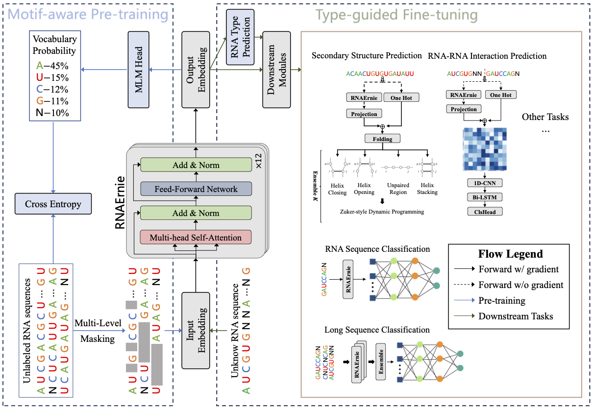

# RNAErnie

Official implement of paper "Multi-purpose RNA Language Modeling with Motif-aware Pre-training and Type-guided Fine-tuning" with [paddlepaddle](https://github.com/PaddlePaddle/Paddle/tree/develop).

This repository contains codes and pre-trained models for RNAErnie, which leverages RNA motifs as **biological priors** and proposes a **motif-level random masking** strategy to enhance pre-training tasks. Furthermore, RNAErnie improves sequence classfication, RNA-RNA interaction prediction, and RNA secondary structure prediction by fine-tuning or adapating on downstream tasks with two-stage **type-guided** learning. Our paper will be published soon.



## Installation

<!-- ### Use Docker Image (Strongly Recommended) -->

### Create Environment with Conda

First, download the repository and create the environment.

```bash
git clone https://github.com/CatIIIIIIII/RNAErnie.git
cd ./RNAErnie
conda env create -f environment.yml
```

Then, activate the "RNAErnie" environment.

```bash
conda activate RNAErnie
```

or you could 

### Pull from Docker
First clone the repository:
```bash
git clone https://github.com/CatIIIIIIII/RNAErnie.git
```
Then pull the docker image from [Docker Hub](https://hub.docker.com/repository/docker/nwang227/rnaernie/general):
```bash
sudo docker pull nwang227/rnaernie:1.1
```
Finally run the container with data volumn mounted:
```bash
sudo docker run --gpus all --name rnaernie_docker -it -v $PWD/RNAErnie:/home/ nwang227/rnaernie:1.1 /bin/bash
```
TODO:
For python version conflict, RNA secondary structure prediction task is not available in docker image. We will fix in the future.

## Pre-training

### 1. Data Preparation

You can download my selected (nts<512) pretraining dataset from [Google Drive](https://drive.google.com/file/d/17nGJz0NW-Kd_Z3wAFhzeW5AUNAka6Yed/view?usp=sharing) or from [RNAcentral](https://ftp.ebi.ac.uk/pub/databases/RNAcentral/current_release/sequences/rnacentral_active.fasta.gz) and place the `.fasta` files in the `./data/pre_random` folder.

Then, you can use the following command to generate the pre-training data:

### 2. Pre-training

Pretrain RNAErnie on selected RNAcentral datasets (nts<=512) with the following command:

```bash
python run_pretrain.py \
    --output_dir=./output \
    --per_device_train_batch_size=50 \
    --learning_rate=0.0001 \
    --save_steps=1000
```

To use multi-gpu training, you can add the following arguments:

```bash
CUDA_VISIBLE_DEVICES=0,1,2,3 python -m paddle.distributed.launch run_pretrain.py 
```

where `CUDA_VISIBLE_DEVICES` specifies the GPU ids you want to use.

### 3. Download Pre-trained Models

Our pre-trained model with BERT, ERNIE and MOTIF masking strategies could be downloaded from [Google Drive](https://drive.google.com/drive/folders/1Ls5k7hv83BLRTznB4XcegIa2yKkU40Ls?usp=drive_link) and place the `.pdparams` and `.json` files in the `./output/BERT,ERNIE,MOTIF,PROMPT` folder.

### 4. Visualization

You can visualize the pre-training process with the following command:

```bash
visualdl --logdir ./output/BERT,ERNIE,MOTIF,PROMPT/runs/you_date/ 
```

### 5. Extract RNA Sequence Embeddings

Then you could extract embeddings of given RNA sequences or from `.fasta` file with the following codes:

```python
import paddle
from rna_ernie import BatchConverter
from paddlenlp.transformers import ErnieModel

# ========== Set device
paddle.set_device("gpu")

# ========== Prepare Data
data = [
    ("RNA1", "GGGUGCGAUCAUACCAGCACUAAUGCCCUCCUGGGAAGUCCUCGUGUUGCACCCCU"),
    ("RNA2", "GGGUGUCGCUCAGUUGGUAGAGUGCUUGCCUGGCAUGCAAGAAACCUUGGUUCAAUCCCCAGCACUGCA"),
    ("RNA3", "CGAUUCNCGUUCCC--CCGCCUCCA"),
]
# data = "./data/ft/seq_cls/nRC/test.fa"

# ========== Batch Converter
batch_converter = BatchConverter(k_mer=1,
                                  vocab_path="./data/vocab/vocab_1MER.txt",
                                  batch_size=256,
                                  max_seq_len=512)

# ========== RNAErnie Model
rna_ernie = ErnieModel.from_pretrained("output/BERT,ERNIE,MOTIF,PROMPT/checkpoint_final/")

# call batch_converter to convert sequences to batch inputs
for names, _, inputs_ids in batch_converter(data):
    with paddle.no_grad():
        # extract whole sequence embeddings
        embeddings = rna_ernie(inputs_ids)[0].detach()
        # extract [CLS] token embedding
        embeddings_cls = embeddings[:, 0, :]
```

## Downstream Tasks

### RNA sequence classification

#### 1. Data Preparation

You can download training data from [Google Drive](https://drive.google.com/drive/folders/1flh2rXiMKIreHE2l4sbjMmwAqfURj4vv?usp=sharing) and place them in the `./data/ft/seq_cls` folder. Three datasets (nRC, lncRNA_H, lncRNA_M) are available for this task.

#### 2. Fine-tuning

Fine-tune RNAErnie on RNA sequence classification task with the following command:

```bash
python run_seq_cls.py \
    --dataset=nRC \
    --dataset_dir=./data/ft/seq_cls \
    --model_name_or_path=./output/BERT,ERNIE,MOTIF,PROMPT/checkpoint_final \
    --train=True \
    --batch_size=50 \
    --num_train_epochs=100 \
    --learning_rate=0.0001 \
    --output=./output_ft/seq_cls
```

Moreover, to train on long ncRNA classification tasks, change augument `--dataset` to `lncRNA_M` or `lncRNA_H`, and you can add the `--use_chunk=True` argument to chunk and ensemble the whole sequence.

To use two-stage fine-tuning, you can add the `--two_stage=True` argument.

#### 3. Evaluation

Or you could download our weights of RNAErnie on sequence classification tasks from [Google Drive](https://drive.google.com/drive/folders/1v7Wx6cOd7_3EGtxTAMWMjtPTwocL5w6-?usp=sharing) and place them in the `./output_ft/seq_cls` folder.

Then you could evaluate the performance with the following codes:  

```bash
python run_seq_cls.py \
    --dataset=nRC \
    --dataset_dir=./data/ft/seq_cls \
    --model_name_or_path=./output/BERT,ERNIE,MOTIF,PROMPT/checkpoint_final \
    --model_path=./output_ft/seq_cls/nRC/BERT,ERNIE,MOTIF,PROMPT/model_state.pdparams \
    --train=False \
    --batch_size=50
```

To evaluate two-stage procedure, you can add the `--two_stage=True` argument and change the `--model_path` to `./output_ft/seq_cls/nRC/BERT,ERNIE,MOTIF,PROMPT,2`.

### RNA RNA interaction prediction

#### 1. Data Preparation

You can download training data from [Google Drive](https://drive.google.com/drive/folders/1iZK3-rw0QCyustOEUaEII8t2wXS2SwFc?usp=sharing) and place them in the `./data/ft/rr_inter` folder.

#### 2. Fine-tuning

Fine-tune RNAErnie on RNA-RNA interaction task with the following command:

```bash
python run_rr_inter.py \
    --dataset=MirTarRAW \
    --dataset_dir=./data/ft/rr_inter \
    --model_name_or_path=./output/BERT,ERNIE,MOTIF,PROMPT/checkpoint_final \
    --train=True \
    --batch_size=256 \
    --num_train_epochs=100 \
    --lr=0.001 \
    --output=./output_ft/rr_inter
```

#### 3. Evaluation

Or you could download our weights of RNAErnie on RNA RNA interaction tasks from [Google Drive](https://drive.google.com/drive/folders/1DgNAngxNlqmlVrHUqn4ygzgzXt0DA4Xy?usp=sharing) and place them in the `./output_ft/rr_inter` folder.

Then you could evaluate the performance with the following codes:  

```bash
python run_rr_inter.py \
    --dataset=MirTarRAW \
    --dataset_dir=./data/ft/rr_inter \
    --model_name_or_path=./output/BERT,ERNIE,MOTIF,PROMPT/checkpoint_final \
    --model_path=./output_ft/rr_inter/MirTarRAW/BERT,ERNIE,MOTIF,PROMPT \
    --train=False \
    --batch_size=256
```

### RNA secondary structure prediction

#### 1. Data Preparation

You can download training data from [Google Drive](https://drive.google.com/drive/folders/1XUBVXAUyIB6NqWmwEdLLlnWFaoU_l3XN?usp=sharing) and unzip and place them in the `./data/ft/ssp` folder. Two tasks (RNAStrAlign-ArchiveII, bpRNA1m) are available for this task.

#### 2. Adaptation

Adapt RNAErnie on RNA secondary structure prediction task with the following command:

```bash
python run_ssp.py \
    --task_name=RNAStrAlign \
    --dataset_dir=./data/ft/ssp \
    --model_name_or_path=./output/BERT,ERNIE,MOTIF,PROMPT/checkpoint_final \
    --train=True \
    --num_train_epochs=50 \
    --lr=0.001 \
    --output=./output_ft/ssp
```

**Note**: we use `interface.*.so` compiled from [mxfold2](https://github.com/mxfold/mxfold2). If you system could not run the `interface.*.so` file, you could download the source code from [here](https://github.com/mxfold/mxfold2/releases/download/v0.1.2/mxfold2-0.1.2.tar.gz) and compile it by yourself. Then copy the generated `interface.*.so` file to `./` path.

#### 3. Evaluation

Or you could download our weights of RNAErnie on RNA secondary structure prediction tasks from [Google Drive](https://drive.google.com/drive/folders/1UljS7YvDdYvWgmR7R5EdBG0OPPbkKoaB?usp=sharing) and place them in the `./output_ft/ssp` folder.

Then you could evaluate the performance with the following codes:  

```bash
python run_ssp.py \
    --task_name=RNAStrAlign \
    --dataset_dir=./data/ft/ssp \
    --train=False
```

If you have any questions, feel free to contact us by email: `rnaernie@gmail.com`.
